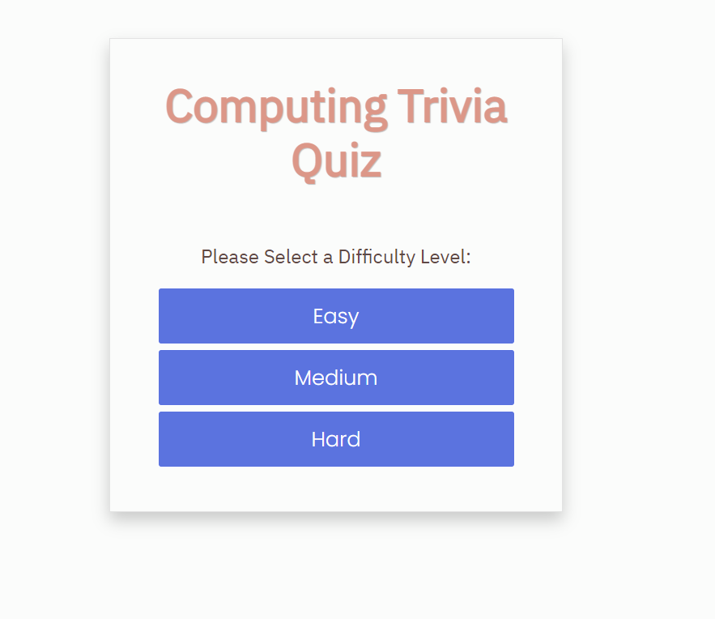
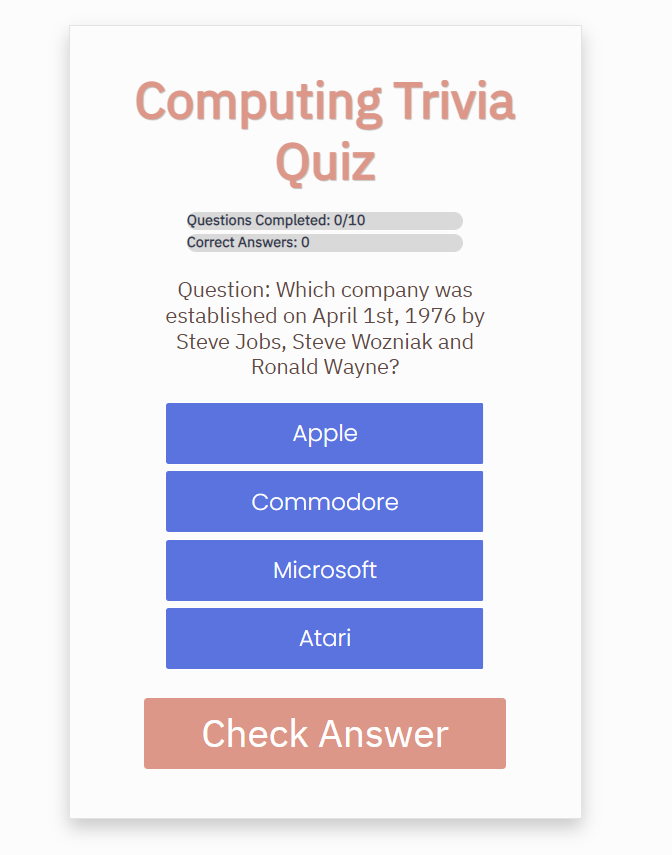
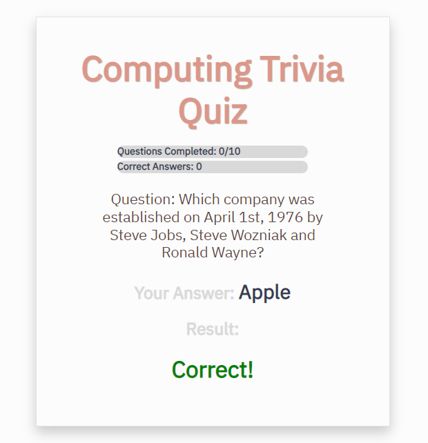

## Computing Trivia Quiz

A web-based application featuring a computing trivia quiz. Built with JavaScript, Bootstrap, and CSS. Makes use of the Open Trivia Database(by Pixeltail Games LLC, located at https://opentdb.com). 

## Project Screen Shot(s)

## Launch Instructions

Clone this repository to your local machine. 

In VS Code, right click on the index.html file and select "Open With Live Server". The application will launch in your web browser.

**Please note that this application requires an internet connection.  

## Reflection

I built this project while studying JavaScript to get familiar with how to build web-based applications. This specific project includes the use of an API and DOM manipulation. One of the challenges of this project included learning how data flows through a JavaScript application.
