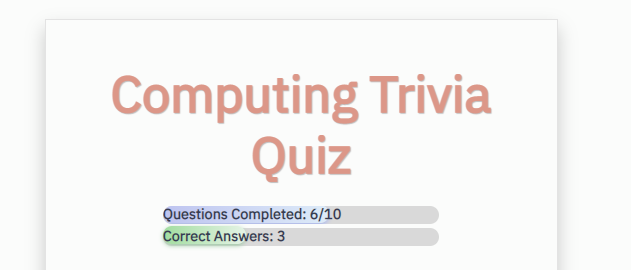

# Computing Trivia Quiz

A web-based application featuring a computing trivia quiz. Built with JavaScript, Bootstrap, and CSS. Makes use of the Open Trivia Database (by Pixeltail Games LLC, located at https://opentdb.com). 

## Project Screen Shots

Quiz Start Screen

To start the quiz, please select a difficulty level.

Trivia Question Screen

You will have four options to choose from.

Individual Question Result Screen

You will be notified if your answer was correct or incorrect.

Status Bars

While taking the quiz, the status bars at the top will change based on the number of questions already completed and the current number of correct answers.

## Launch Instructions

Clone or download this repository to your local machine. 

In the file folder, double click on the index.html file. The application will launch in your web browser.

**Please note that this application requires an internet connection.  

## Reflection

I built this project while studying JavaScript to get familiar with how to build web-based applications. This specific project includes the use of an API and DOM manipulation. One of the challenges of this project included learning how data flows through a JavaScript application.

## References

- 3.5 - Trivia API - https://www.youtube.com/watch?v=SgJ_femmsfg (For basic guidance on how to work with the Trivia API.)